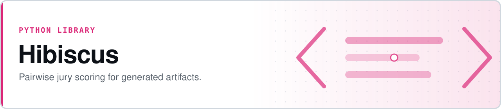

<p align="center">
  <picture>
    <source media="(prefers-color-scheme: dark)" srcset="assets/banner-dark.svg">
    
  </picture>
</p>

# Hibiscus

**Judge generated artifacts the way a jury does — not with a score out of five, but by hanging each candidate next to accepted work and asking which is better.**

Rate your candidates into tiers, keep the best as the hung set, and score everything after by how often it wins. Hibiscus is a dependency-free Python library and CLI for pairwise evaluation, with the calibration and saturation checks needed to know whether the answer means anything.

- **Pairwise, not absolute** — judges are measurably more reliable at "which is better?" than at "rate this 0–10", and the dynamic range that absolute rubrics compress away comes back
- **Position bias controlled by construction** — every comparison is judged in both orders and resolved into a single outcome; ties leave the denominator rather than padding it
- **It tells you when it isn't working** — calibration exits non-zero if your own `okay`/`nope` items don't rank below `love`, and saturation answers whether the pool is big enough yet
- **Ships the diagnostic that motivated it** — a dimension-correlation report you can point at any existing rubric's score history to catch redundant judges


**[Quickstart](#quickstart-cli)** · **[Python API](#python-api)** · **[Judge interface](#judge-interface)** · **[Worked example](examples/worked_example.py)** · **[Non-goals](#non-goals)**

```bash
pip install -e .
hibiscus rate    --artifacts candidates.jsonl --pool pools/my-pool.jsonl
hibiscus compare --candidates new.jsonl --pool pools/my-pool.jsonl --seed 42 --out comparisons.jsonl
hibiscus score   --comparisons comparisons.jsonl --out scores.json
```

The default `--judge mock` is deterministic and offline, so the whole pipeline dry-runs without an API key.

## Why not just score things 0–10?

Absolute rubric scoring fails in a specific, documented way. In a comparable
project — [reinforcement learning for generative art](https://surya.website/rling-qwen-to-paint-with-code) —
a nine-signal absolute rubric plateaued, and every output converged to look
identical. The diagnosis: five of the nine judges correlated at 0.85–0.95
with each other — measuring the same thing five times — while the one
signal with real variance carried only 10% of the weight. Absolute 0–10
scores came back compressed near zero, with no room for the judge to
express a preference.

Two fixes worked there, and Hibiscus packages both:

1. **Pairwise judgment.** Show the judge the candidate plus references
   sampled from a rated pool and ask which is better. Reward becomes the
   fraction of comparisons won. Dynamic range opens up, because judges are
   measurably more reliable at relative questions ("which is better?") than
   at absolute ones ("rate this 0–10").
2. **A hand-rated reference pool.** 1,664 candidates were rated one at a
   time into love / okay / nope; the 117 love-tier examples became the
   comparison set. Notably, human-made references weren't available for
   that project's niche medium — the entire pool was model output that a
   human rated. Hibiscus assumes the same by default: **the pool is
   curated taste, not ground truth.**

Hibiscus also ships the diagnostic that found the original problem: a
dimension-correlation report you can point at any set of scores — its own
output or an existing rubric's history — to catch redundant judges before
they quietly dominate a weighted average.

## Core concepts

| Concept        | Meaning |
|-----------------|---------|
| **Artifact**    | Any text blob with an id and optional metadata. Domain-agnostic — prose, code, docs, synthetic data. |
| **Tier**        | `love` / `okay` / `nope`. Exactly three, ordered. `love` is the "hung set" used as comparison foils. |
| **Pool**        | The rated collection, one artifact kind per pool. Multiple named pools are just multiple files. |
| **Comparison**  | One candidate vs. one reference, judged in both orders to control for position bias. |
| **Pair outcome**| Those two orders resolved into one result: win, loss, or tie. Ties leave the denominator. |
| **Win rate**    | Fraction of *decisive pairs* won, reported with a Wilson score confidence interval. |

## Install

```bash
pip install -e .            # core library + CLI
pip install -e ".[anthropic]"  # + the Anthropic judge adapter
pip install -e ".[dev]"        # + test dependencies
```

Requires Python 3.10+. No dependencies beyond the standard library unless
you use the Anthropic adapter.

## Quickstart (CLI)

```bash
# 1. Rate a batch of candidates into love/okay/nope. One keystroke per item
#    (SHIFT+key to add a note), resumable — quitting and rerunning skips
#    anything already rated.
hibiscus rate --artifacts candidates.jsonl --pool pools/my-pool.jsonl

# 2. Compare new candidates against the love tier (k=2 references, both
#    orders, seeded for reproducibility).
hibiscus compare \
  --candidates new_candidates.jsonl \
  --pool pools/my-pool.jsonl \
  --seed 42 \
  --judge anthropic --model claude-sonnet-5 \
  --cache cache/judge_cache.jsonl \
  --out comparisons.jsonl

# 3. Turn comparisons into win rates with confidence intervals (and a
#    warning if the candidates aren't actually separating).
hibiscus score --comparisons comparisons.jsonl --out scores.json

# 3b. Sanity-check the judge against tiers you already rated. Exits
#     non-zero if your own okay/nope items don't rank below love.
hibiscus calibrate --pool pools/my-pool.jsonl --seed 42 --judge anthropic

# 3c. Ask whether the pool is big enough yet, empirically.
hibiscus saturate --pool pools/my-pool.jsonl --candidates probes.jsonl \
  --seed 42 --cache cache/judge_cache.jsonl

# 4. Run the correlation diagnostic on any {artifact_id, dimension, score}
#    data — Hibiscus's own or an existing rubric's history.
hibiscus report --data existing_rubric_scores.csv --threshold 0.85
```

`--judge mock` (the default) uses a deterministic, offline judge — useful
for dry-running a pipeline without an API key. See [`examples/worked_example.py`](examples/worked_example.py)
for a full run using it.

### `hibiscus pool`

```bash
hibiscus pool add --pool pools/my-pool.jsonl --id ex-042 --text-file ex-042.txt --tier love --note "clean structure"
hibiscus pool list --pool pools/my-pool.jsonl --tier love
hibiscus pool export --pool pools/my-pool.jsonl --out backup.jsonl
hibiscus pool import --pool pools/my-pool.jsonl --src backup.jsonl
```

Artifact and rating files are UTF-8 JSONL, one object per line:

```json
{"id": "ex-042", "text": "...", "metadata": {"kind": "meeting-notes"}}
```

## Python API

```python
from hibiscus import Artifact, Pool, RatedArtifact, Tier
from hibiscus.compare import run_comparisons, order_disagreement_rate
from hibiscus.judge.mock import MockJudge
from hibiscus.score import score_candidate

pool = Pool("pools/my-pool.jsonl")
pool.add(RatedArtifact(id="ref-1", text="a reference worth citing", tier=Tier.LOVE))

candidate = Artifact(id="cand-1", text="the new thing to judge")
records = run_comparisons(candidate, pool, MockJudge(), k=2, seed=42, model="mock-v1")

print(order_disagreement_rate(records))          # judge-reliability signal
print(score_candidate(records, candidate_id="cand-1"))  # WinRateResult
```

## Components

1. **`rate`** — human rating CLI. One artifact at a time; `l`/`o`/`n`
   records the rating and advances immediately — no Enter, no
   confirmation. Shift the key (`L`/`O`/`N`) to attach a free-text note
   to that rating. Resumable, and never re-presents an already-rated
   item.
2. **`pool`** — storage and query. Add, list, filter by tier, export/import
   JSONL. Explicit UTF-8 on every read and write, always.
3. **`compare`** — samples K references from a chosen tier (default:
   `love`, K=2), runs the pairwise judge, and controls for position bias by
   running every comparison in both orders. Surfaces the order-disagreement
   rate as a judge-reliability signal: if the judge's answer flips with
   position, it isn't discriminating on content.

   The two orders are **two measurements of one comparison**, so they are
   resolved into a single outcome before anything is counted — see
   [How a pair is scored](#how-a-pair-is-scored).
4. **`score`** — aggregates comparisons into a win rate with a Wilson score
   confidence interval. Supports per-dimension scoring when comparisons
   carry a `dimension`, but a single overall judgment is the default and
   the recommended path. Scoring more than one candidate also reports the
   **spread** across the set, and warns when it isn't distinguishable
   from sampling noise (see below).
5. **`calibrate`** — the validity check. Scores your own `okay` and
   `nope` items as if they were candidates against the `love` pool. You
   already know how they should rank, so if they don't, the judge or the
   pool is wrong and no score from this pipeline means what it appears
   to. Uses only rating data you already have, never compares a pool
   item against itself, and exits non-zero on failure so it can gate a
   run.
6. **`saturate`** — the sizing check. Scores probe candidates against
   reference subsets of growing size and reports when the answer stops
   moving, so "is my pool big enough?" is answered from data instead of
   guessed. Reports rate stability and ordering stability separately.
7. **`rank`** — optional Bradley-Terry ranking of candidates against each
   other, with a per-judge effect. Relative, population-dependent, and
   explicitly not an acceptance gate; see
   [Ranking candidates against each other](#ranking-candidates-against-each-other).
8. **`report`** — the correlation diagnostic. Given any set of artifacts
   scored on multiple dimensions (CSV or JSONL of
   `{artifact_id, dimension, score}`), outputs a correlation matrix and
   flags pairs above a threshold (default 0.85) as redundant. Works on
   externally-produced score data, not just Hibiscus's own.

## How a pair is scored

`compare` judges each candidate-reference pair twice, once in each order.
Those are two measurements of one comparison, not two comparisons, so
they resolve to a single outcome before anything is counted:

| candidate-first says | reference-first says | outcome |
|---|---|---|
| candidate | candidate | **win** |
| reference | reference | **loss** |
| they disagree | | **tie** (order-disagreement) |
| either says TIE | | **tie** (judge) |

Ties are excluded from the win-rate denominator — symmetrically, so they
bias nothing — and reported separately as a tie rate.

This matters more than it sounds. Counting each order as an independent
trial does two bad things: it doubles `n`, making every confidence
interval far narrower than the evidence supports; and it records an
order-dependent verdict as one win *plus* one loss, dragging the
candidate toward an exact coin flip. A judge with pure position bias —
one that always picks whichever text is shown first — would score a
confident-looking 50% on every candidate. That is score compression
manufactured by the scoring layer, the exact failure this library exists
to detect. Resolved properly, that judge produces a 100% tie rate and no
win rate at all, which is the truthful answer.

Two consequences worth knowing:

- **A candidate can have no score.** If every pair ties, there is no win
  rate; `has_signal` is False and the CLI says *no discriminating
  comparisons* rather than printing a 0%.
- **Judge ties and disagreement ties are counted separately.** "These are
  equivalent" and "this judge can't tell" are different findings, even
  though both leave the denominator.

Comparison files written before this change are still readable. They are
re-scored with the corrected logic and the CLI prints a note saying so,
because the numbers will differ from anything previously reported for the
same file.

## Checking that the answer actually worked

Switching to pairwise comparison is supposed to fix two things: scores
that collapse into a narrow band, and dimensions that secretly measure
the same thing. The correlation report catches the second. Two more
pieces catch the first, and catch the case where the whole setup is
quietly broken.

**Spread.** The original failure was *scores compressed near zero, every
output looking identical*. Per-candidate win rates won't show you that —
each one looks like a perfectly respectable number. So `score` also
reports the distribution across the candidate set, and compares the
observed spread against the spread you'd get from sampling noise alone
if every candidate had the same true win rate:

```
c0:overall: 50.0% win rate [18.8%, 81.2%] (3/6 decisive pairs, 0 ties)
c1:overall: 50.0% win rate [18.8%, 81.2%] (3/6 decisive pairs, 0 ties)
...
spread across 6 candidates: 50.0%–50.0% (sd 0.000, 0.00x sampling noise)
warning: win rates are not clearly separated from what pure sampling noise
would produce — the judge may not be discriminating between these candidates.
```

A ratio near 1.0 means the differences between your candidates are
indistinguishable from coin flips, however confident the individual
intervals look. This is the compression failure, reported rather than
hidden.

**Calibration.** A win rate against the love pool only means something
if the judge agrees with the taste that built that pool — and the pool
is curated taste, not ground truth. You can check this without labeling
anything new, because you already rated items you *know* are worse:

```bash
hibiscus calibrate --pool pools/my-pool.jsonl --seed 42 \
  --judge anthropic --model claude-sonnet-5
```

It scores your `okay` and `nope` items as candidates against the `love`
pool (never comparing a pool item against itself) and checks that the
result reproduces the ordering you assigned by hand:

```
   love:  62.5% [41.0%, 80.0%]  25 items, 100 comparisons
   okay:  28.0% [19.9%, 37.9%]  25 items, 100 comparisons
   nope:   6.0% [ 2.8%, 12.5%]  25 items, 100 comparisons

PASS — win rates follow your hand-assigned tier ordering.
```

A lower tier outscoring a higher one is reported as an inversion, and so
is the case where every tier lands on the same number. Ties *between the
lower tiers* are tolerated: when every foil is drawn from the love tier,
`okay` and `nope` can both legitimately floor near zero. The command
exits non-zero on failure, so it can gate a scoring run in CI.

Run it before trusting a new judge model, a new prompt, or a freshly
built pool — it is the cheapest evidence you can get that the pipeline
measures what you think it does.

**Saturation.** "How many references do I need?" is answerable
empirically rather than by guessing, which is what lets Hibiscus be
dropped into a new project: rate until saturation says stop.

```bash
hibiscus saturate --pool pools/my-pool.jsonl --candidates probes.jsonl \
  --seed 42 --cache cache/judge_cache.jsonl
```

It scores the same probe candidates against reference subsets of growing
size, several seeded subsets per size, and reports how much the answer
still moves:

```
 size   mean move   ordering tau   within-size sd
    5           —              —            0.067
   10       0.017          1.000            0.017
   15       0.039          1.000            0.000
   18       0.022          1.000            0.000

ordering settled at 10 references (tau >= 0.9 for two consecutive sizes)
win rates settled at 10 references (mean move <= 0.05 for two consecutive sizes)
```

Ordering stability (Kendall tau-b) and absolute-rate stability are
reported separately, because ordering usually settles first and is often
what you actually need. Pass `--cache`; subsets overlap heavily, so most
of the work becomes cache hits.

Like the others, this is bounded in what it claims: it shows the
*measurement* has stopped moving, not that the pool captures your taste.
A pool can saturate around a consistently wrong answer. `calibrate` is
the check for that.

**Length bias.** After position, length is the best-documented pairwise
judge bias — judges over-prefer longer texts on tasks that don't penalize
verbosity. `score` reports the correlation between candidate length and
win rate next to the other diagnostics:

```
length-vs-win-rate correlation: +1.00
warning: |r| >= 0.4 — the judge may be rewarding length rather than quality.
```

Reported, never corrected for. Whether length is legitimately part of
quality depends on what you're judging, and that call is yours.

## Judge interface

Judges are pluggable via `hibiscus.judge.base.JudgeAdapter`:

```python
class JudgeAdapter(ABC):
    def compare(self, text_a: str, text_b: str, question: str) -> JudgeVerdict:
        ...  # JudgeVerdict(winner="a" | "b" | "tie", raw_response=...)
```

The judge receives **only** `text_a`, `text_b`, and `question` — never an
artifact id, tier label, or pool metadata. This is enforced by
`hibiscus.judge.payload.build_judge_payload`, which whitelists the payload
by construction and asserts on it before any call is made, so a leak fails
the build, not the judge call.

Two adapters ship in the box:

- `hibiscus.judge.mock.MockJudge` — deterministic, offline, hash-based.
  Good for pipeline smoke tests.
- `hibiscus.judge.anthropic_adapter.AnthropicJudge` — calls a Claude model.
  Requires `pip install hibiscus[anthropic]` and `ANTHROPIC_API_KEY`
  (or pass `api_key=`).

A verdict may be `"a"`, `"b"`, or `"tie"`. Ties exist so that genuinely
indistinguishable pairs aren't coin-flipped into the win rate as noise;
they leave the denominator instead. The default prompt permits a tie
without inviting one, because judges markedly over-use ties when offered
them as an equal third option.

The default comparison question is deliberately short:

> Below are two texts, A and B. Which one is better? Answer with only A
> or B. Answer TIE only if you genuinely cannot tell them apart.

A long rubric in the prompt measurably hurt judgment quality in the project
this library is based on — a 400-line API reference in a system prompt
made a model hallucinate, while a short, opinionated allowlist outperformed
the full spec. Override the question per-call (`--question` / `question=`)
if you need to steer it, but keep it short.

### Why not Elo?

Elo (and its descendants) is the obvious way to turn pairwise outcomes
into ratings, and Hibiscus deliberately doesn't use it as the headline
number. The reason is the anchor.

**Elo has no fixed origin.** A rating is meaningful only relative to the
pool of players it was earned against, and it drifts as that pool
changes. Ported to generated artifacts, a candidate's score would depend
on what else happened to be generated the same week, and this month's
numbers would not be comparable with last month's. Rating inflation in
chess is the same phenomenon: the number moved because the population
did.

**Hibiscus trades that away for a fixed anchor.** The love-tier pool does
not play and does not update. It is a frozen ruler. "Won 63% of
comparisons against the pool" means the same thing in March as in
September, which is exactly what you need for an acceptance gate —
*ship it if it clears 60%* is a sentence you can write about a win rate
and cannot write about an Elo score. Freezing the reference set costs you
the ability to track a moving population; that is the trade, made on
purpose.

**Rating and ranking are different questions.** Elo estimates strength
among peers. Hibiscus measures distance from curated taste. The pool
encodes one person's judgment about what is good, not a population
average, and it is supposed to — see the jury framing at the top.

That said, the paired-comparison literature is where most of this comes
from, and Hibiscus borrows two things from it. Bradley-Terry is available
for the cases where you genuinely do want relative ranking (see
[Ranking candidates against each other](#ranking-candidates-against-each-other)),
carrying the same drift caveat. And the idea of matching opponents near a
candidate's own level is why references are sampled from a chosen tier
rather than the whole pool.

### Why pairwise, and not listwise

Each judge call sees exactly two texts: the candidate and one reference.
Sampling `k=2` references means four calls per candidate (two references ×
two orders), not one call showing the judge everything at once. Bundling
all the references into a single call is cheaper, and it is the obvious
thing to reach for, so it's worth saying why this library doesn't:

- **Position control stays exact.** "Run it in both orders" is well-defined
  for two texts. Three texts have six orderings, so you'd have to sample or
  rotate, and the order-disagreement rate — a headline reliability signal
  here — would stop being a clean flip rate.
- **The Wilson interval stays honest.** It assumes independent Bernoulli
  trials, which is precisely what one-vs-one comparisons produce. A single
  call ranking N+1 texts is multinomial; collapsing it to won/lost both
  discards information and quietly breaks the independence assumption.
- **The cache stays useful.** Keys are per (candidate, reference) pair, so
  resampling references reuses whatever overlaps. Keyed on a whole bundle,
  swapping one reference would invalidate the entire call.
- **The prompt stays short**, for the reason described just above — and
  "which of these two is better" is the simplest possible relative
  question, which is the whole reason for preferring comparison over
  absolute scoring in the first place.

The cost lever is `k` (and the cache, and the choice of judge model), none
of which change the adapter interface.

## Ranking candidates against each other

Everything above measures distance from the frozen pool. If you instead
want to rank a batch *against itself*, there is an optional
Bradley-Terry mode:

```bash
hibiscus rank --candidates candidates.jsonl --judge anthropic
```

```
Bradley-Terry over 6 decisive comparisons among 4 candidates (converged)

    1. lighthouse-draft         +1.842
    2. kettle-draft             +0.503
    3. mailbox-draft            -0.677
    4. filler-draft             -1.668
```

It round-robins the candidates, resolves pairs exactly as `score` does
(ties excluded), and fits strengths by penalized maximum likelihood. The
model carries a **per-judge effect**, so a harsh judge and a lenient one
can be placed on the same scale — which matters the moment you run more
than one judge model:

```
judge effects (positive = more lenient toward the candidate side):
  claude-sonnet-5              +0.412
  some-other-model             -0.388
```

**These strengths are relative and population-dependent.** They shift
when the batch changes, they are not comparable across runs, and they
have precisely the drift property the pool anchor was designed to avoid.
So: do not use them as an acceptance threshold, and do not average them
together with a pool-anchored win rate — they are not the same kind of
number. `score` remains the default and the recommended path.

## Determinism and reproducibility

- Reference sampling is seeded (`random.Random(seed)`); the same seed
  against the same pool always samples the same references.
- Every comparison is logged: candidate id, reference id, order, judge
  response, timestamp, model id, and a hash of the comparison prompt.
- Judge calls default to temperature 0 (configurable on the adapter).
- Judge responses are cached, keyed on `(candidate hash, reference hash,
  order, prompt hash, model)` — identical inputs never re-hit the judge, so
  reruns are free and byte-for-byte reproducible.

## Non-goals

Hibiscus does not generate artifacts, fine-tune models, train reward
models, or assume any domain-specific document schema. It judges text you
already have.

## Testing

```bash
pip install -e ".[dev]"
pytest
```

The full suite runs without network access — the Anthropic adapter is
never exercised directly; a mock/fake `JudgeAdapter` stands in everywhere
comparisons need a judge.

## Worked example

```bash
pip install -e .
python examples/worked_example.py
```

Builds a five-item love-tier pool, compares two candidates against it with
`MockJudge`, prints win rates with Wilson intervals over decisive pairs,
calibrates the judge against the pool's own tiers, shows the spread check
catching a set where nothing separates, and runs the correlation
diagnostic on synthetic dimension scores containing a deliberately
duplicated signal — the same kind of redundancy that motivated this
library.

Calibration **fails** in that run, deliberately: `MockJudge` decides by
hashing text, so it has no taste to reproduce and the check says so. That
is the diagnostic working, not a broken demo.

## License

MIT — see [LICENSE](LICENSE).
